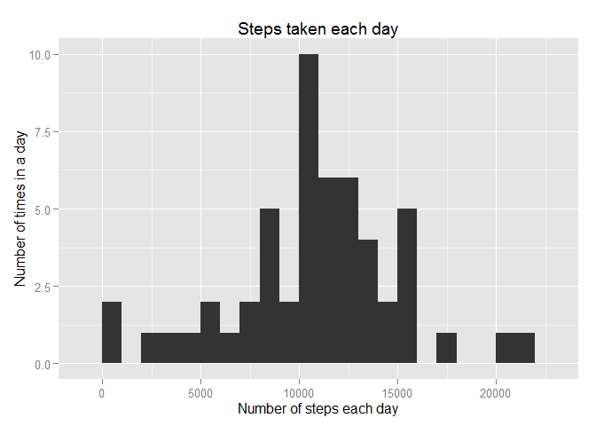
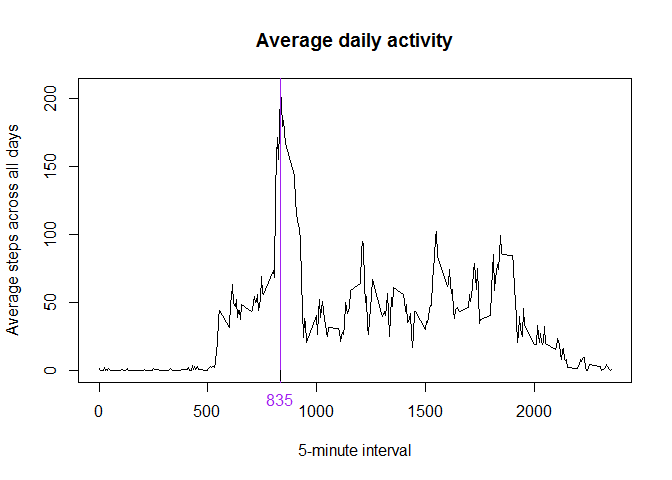
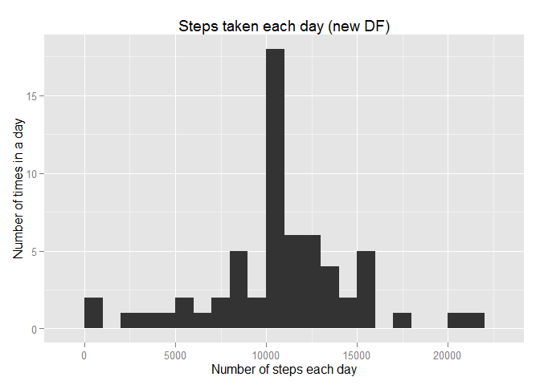

# Reproducible Research: Peer Assessment 1


## Loading and preprocessing the data

We extract the .csv file from the zip and adjust the column "date" withe a Date format:

```r
DF <- read.csv(unz("activity.zip", "activity.csv"), colClasses=c("integer", "Date", "integer"))

head(DF)
```

```
##   steps       date interval
## 1    NA 2012-10-01        0
## 2    NA 2012-10-01        5
## 3    NA 2012-10-01       10
## 4    NA 2012-10-01       15
## 5    NA 2012-10-01       20
## 6    NA 2012-10-01       25
```

```r
summary(DF)
```

```
##      steps             date               interval     
##  Min.   :  0.00   Min.   :2012-10-01   Min.   :   0.0  
##  1st Qu.:  0.00   1st Qu.:2012-10-16   1st Qu.: 588.8  
##  Median :  0.00   Median :2012-10-31   Median :1177.5  
##  Mean   : 37.38   Mean   :2012-10-31   Mean   :1177.5  
##  3rd Qu.: 12.00   3rd Qu.:2012-11-15   3rd Qu.:1766.2  
##  Max.   :806.00   Max.   :2012-11-30   Max.   :2355.0  
##  NA's   :2304
```

```r
str(DF)
```

```
## 'data.frame':	17568 obs. of  3 variables:
##  $ steps   : int  NA NA NA NA NA NA NA NA NA NA ...
##  $ date    : Date, format: "2012-10-01" "2012-10-01" ...
##  $ interval: int  0 5 10 15 20 25 30 35 40 45 ...
```
## What is mean total number of steps taken per day?

First we select the data we need and group it per date. Then we sum the steps for each day:


```r
library(dplyr)
stepsDay<-DF %>%
        select(steps, date) %>%
        group_by(date) %>%
        summarise(sumSteps=sum(steps))

head(stepsDay)
```

```
## Source: local data frame [6 x 2]
## 
##         date sumSteps
## 1 2012-10-01       NA
## 2 2012-10-02      126
## 3 2012-10-03    11352
## 4 2012-10-04    12116
## 5 2012-10-05    13294
## 6 2012-10-06    15420
```

Now we prepare the histogram of the total number of steps taken each day:
(we adjust the bindwith to 1.000 steps)


```r
library(ggplot2)
ggplot(data=stepsDay, aes(sumSteps)) + 
        geom_histogram(binwidth = 1000) +
        labs(title="Steps taken each day", 
             x = "Number of steps each day", y = "Number of times in a day")
```

 

Now we calculate the **mean** and **median** total number of steps taken per day with this code 

```r
mean(stepsDay$sumSteps, na.rm=TRUE)
```

```
## [1] 10766.19
```

```r
median(stepsDay$sumSteps, na.rm=TRUE)
```

```
## [1] 10765
```

## What is the average daily activity pattern?

Now we make a time series plot of the 5-minute interval (x-axis) and the average number of steps taken, averaged across all days (y-axis):


```r
#To plot average daily activity
DF %>%  group_by(interval) %>% 
        summarize(mean=mean(steps, na.rm=TRUE)) %>% 
        plot(., type="l", main="Average daily activity", 
             xlab="5-minute interval", ylab="Average steps across all days")

#To display the interval with the max. number of steps in average on the plot
max<-DF %>%  group_by(interval) %>% 
        summarize(mean=mean(steps, na.rm=TRUE)) %>% 
        slice(which.max(mean)) %>% select(interval)

abline(v=max, col="purple")
axis(1, at=max, labels = max, pos=0, col.axis="purple")
```

 

In purple we see the interval with the maximum number of steps. And here the exact  
interval and his mean:

```r
DF %>%  group_by(interval) %>% 
        summarize(mean=mean(steps, na.rm=TRUE)) %>% 
        slice(which.max(mean)) #slice selects rows by position
```

```
## Source: local data frame [1 x 2]
## 
##   interval     mean
## 1      835 206.1698
```


## Imputing missing values
Note that there are a number of days/intervals where there are missing
values (coded as `NA`). The presence of missing days may introduce
bias into some calculations or summaries of the data.


```r
summary(DF)
```

```
##      steps             date               interval     
##  Min.   :  0.00   Min.   :2012-10-01   Min.   :   0.0  
##  1st Qu.:  0.00   1st Qu.:2012-10-16   1st Qu.: 588.8  
##  Median :  0.00   Median :2012-10-31   Median :1177.5  
##  Mean   : 37.38   Mean   :2012-10-31   Mean   :1177.5  
##  3rd Qu.: 12.00   3rd Qu.:2012-11-15   3rd Qu.:1766.2  
##  Max.   :806.00   Max.   :2012-11-30   Max.   :2355.0  
##  NA's   :2304
```
1. There are **2304**  missing values in the dataset


2. We will fill the NA's with the mean for that 5-minute interval, etc.

3. Create a new dataset that is equal to the original dataset but with the missing data filled in.

```r
# Split main DF in two DF, one with NAs and one without NAs
DF_noNA <-DF %>% filter(complete.cases(.))
DF_NA <-DF %>% filter(!complete.cases(.))

# Create DF with intervals and their step means
meanSteps <- DF %>% group_by(interval) %>% summarize(mean=mean(steps, na.rm=TRUE))

# Merge means with DF with NAs by "interval"
DF_NA <- merge(meanSteps, DF_NA, by = "interval", all.y=TRUE)
DF_NA <- DF_NA[,c(2,4,1)] #remove column not needed and reorder columns
colnames(DF_NA) <-c("steps", "date", "interval") #rename columns

# Merge DF with no NA's and with the DF with means
DF_new <- rbind(DF_noNA, DF_NA)
```


Here the histogram of the new DF


```r
library(dplyr)
library(ggplot2)
stepsDay_new<- DF_new %>%
        select(steps, date) %>%
        group_by(date) %>%
        summarise(sumSteps=sum(steps)) 


ggplot(data=stepsDay_new, aes(sumSteps)) + 
        geom_histogram(binwidth = 1000) +
        labs(title="Steps taken each day (new DF)", 
             x = "Number of steps each day", y = "Number of times in a day")
```

 
  
Here the **mean** and **median** of the new DF 


```r
mean(stepsDay_new$sumSteps, na.rm=TRUE)
```

```
## [1] 10766.19
```

```r
median(stepsDay_new$sumSteps, na.rm=TRUE)
```

```
## [1] 10766.19
```

```r
summary(stepsDay$sumSteps) # before
```

```
##    Min. 1st Qu.  Median    Mean 3rd Qu.    Max.    NA's 
##      41    8841   10760   10770   13290   21190       8
```

```r
summary(stepsDay_new$sumSteps) # now
```

```
##    Min. 1st Qu.  Median    Mean 3rd Qu.    Max. 
##      41    9819   10770   10770   12810   21190
```

Now the estimates have changed as follows:  
-  We have now more observations as shown in the histogram (we added data to the NAs)  
-  Mean stays the same (the strategy was to use the mean to fulfil the missing values)  
-  Now the median is the same as the mean  


## Are there differences in activity patterns between weekdays and weekends?
For this part we are going to use the data set with the filled-in missing values.

We will add a new column with the information, Weekday or Weekend.


```r
library(dplyr)

DF_new$weekday <- as.factor(
        ifelse(weekdays(DF_new$date) %in% c("Samstag","Sonntag"), "Weekend", "Weekday")
        ) 

str(DF_new)
```

```
## 'data.frame':	17568 obs. of  4 variables:
##  $ steps   : num  0 0 0 0 0 0 0 0 0 0 ...
##  $ date    : Date, format: "2012-10-02" "2012-10-02" ...
##  $ interval: int  0 5 10 15 20 25 30 35 40 45 ...
##  $ weekday : Factor w/ 2 levels "Weekday","Weekend": 1 1 1 1 1 1 1 1 1 1 ...
```

Now we make a plot containing a time series plot of the 5-minute interval (x-axis) and the average number of steps taken, averaged across all weekday days or weekend days (y-axis).


```r
library(dplyr)
library(lattice)
DF_new_weekday <- DF_new %>% 
        group_by(interval, weekday) %>%
        summarise(steps = mean( steps, na.rm=TRUE ))

xyplot(steps~interval | weekday, data = DF_new_weekday,
       type="l", ylab="Number of steps", 
       xlab="Interval",
       layout=c(1,2))
```

 
